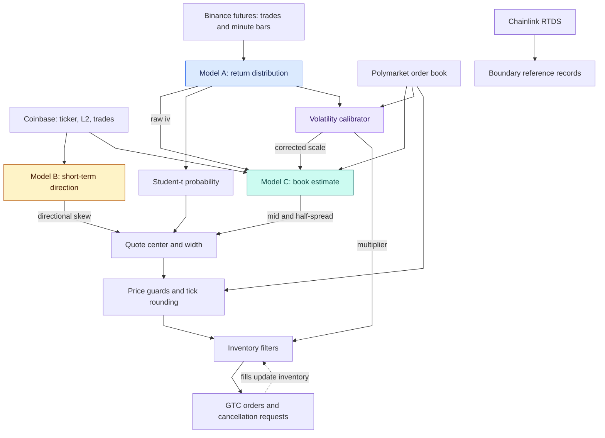

# poly-15min

**English** · [简体中文](README.zh-CN.md)

 [](LICENSE)

A quantitative market-making engine for Polymarket's 15-minute crypto **up/down** binary contracts, driven by three independently trained Transformer models. It is published as a reference for binary-option market making and applied sequence modeling.

> [!IMPORTANT]
> **Archived and unmaintained.** **All code and documentation in this repository were generated by AI.** The code was generated through a **chat interface using GPT-5**, and the documentation was generated using **Opus and GPT-6**.
>
> **Neither the code nor the documentation has undergone human review for correctness.** The code used in live trading was never reviewed by the author. The documentation may conflict with the implementation; consult the source code to determine what the system actually does.
>
> The strategy was profitable on BTC for a period and stopped being profitable in **late December 2025**. **Its profits were only a tiny fraction of those earned by the top accounts.**
>
> The live system was modified continuously. This repository broadly represents that system, but its code and model parameters may differ from those used during live trading and may not match any particular live version.

> [!WARNING]
> **Do not connect this system to a funded account.** **Authentication material is logged in plaintext**, and some safety checks terminate the process **without canceling outstanding orders**.
>
> **Use this repository at your own risk.** It is provided for research and algorithm discussion, without warranties or investment advice. **To the extent permitted by applicable law, the author accepts no liability for trading losses or other damages arising from its use.** See the [LICENSE](LICENSE) for the governing terms.

**[Models](#the-three-models) · [Architecture](#how-it-works) · [Technical manual](docs/technical-reference.md) · [License](#license)**

## Contents

| Strategy and models | Implementation and reference |
|---|---|
| [What this is](#what-this-is) | [Repository layout](#repository-layout) |
| [At a glance](#at-a-glance) | [Environment and configuration](#environment-and-configuration) |
| [How it works](#how-it-works) | [Training data and checkpoints](#training-data-and-checkpoints) |
| [The three models](#the-three-models) | [Technical documentation](#technical-documentation) |
| [Volatility calibration](#volatility-calibration) | [When and why it stopped being profitable](#when-and-why-it-stopped-being-profitable) |
| [How a quote gets made](#how-a-quote-gets-made) | [License](#license) |
| [The 15-minute lifecycle](#the-15-minute-lifecycle) |  |

---

## What this is

The system targets rolling contracts that ask whether an underlying crypto asset will finish a 15-minute window at or above its opening reference price. The winning token pays $1 per share and the losing token pays $0, subject to the individual market's resolution rules. A slug such as `btc-updown-15m-1765306800` identifies the asset and window start.

The strategy builds buy and sell quotes around an estimated contract value, aiming to earn the spread while managing the inventory created by fills. It also uses short-horizon directional signals to shift quotes and can restrict trading to one side. YES and NO have complementary payouts. Their quoted and executable prices depend on the orders available in each book and can sum to more or less than $1.

Three different estimates support that process:

1. **The distribution of underlying returns.** How widely could the price move before expiration, and what probability does that imply for an Up outcome?
2. **Short-term direction.** Is the underlying likely to move over the next few seconds, and should the quote move with it?
3. **The Polymarket book.** What mid-price and half-spread should the engine use as its starting point?

The engine combines these estimates, applies price and inventory controls, and manages orders throughout a 900-second contract window. Model probabilities guide the strategy; executable prices depend on available liquidity.

---

## At a glance

| Property | Value |
|---|---|
| Venue | Polymarket CLOB; the client is configured for Polygon |
| Instrument | 15-minute crypto up/down binary contracts |
| Strategy | Market making with directional quote adjustments and inventory filters |
| Assets modeled | BTC, ETH, SOL, XRP |
| Asset traded | **BTC only**, through `allowed_bases={"BTC"}` |
| Contract duration | 900 seconds; nominal quoting interval of 877 seconds |
| Models | 3 architectures, 6 checkpoints, 5,772,944 trainable parameters in total |
| Market data | Binance perpetual futures, Coinbase, Polymarket CLOB, Chainlink via RTDS |
| Stack | Python 3.10+, PyTorch, asyncio |
| Source | 11 Python modules, 14,234 lines |

All four assets have market-data and prediction paths. The trading engine accepts only BTC snapshots; the other assets are still modeled and logged.

---

## How it works



The models have distinct roles. A supplies a return distribution, B adjusts direction, and C provides the primary quote center and width. A's raw scale and a market-adjusted scale also enter C. The separate calibration multiplier changes inventory limits. The trader's Student-t probability calculation uses A's raw scale.

Coinbase supplies the current underlying-price proxy and a locally sampled opening reference. Chainlink observations are recorded near window boundaries. Contract resolution and settlement are handled by the venue.

---

## The three models

Each model uses a Transformer encoder to summarize recent market history. Their inputs, output structures, and use of asset-specific parameters differ.

| Model | Sequence | Other inputs | Encoder width | Output | Trainable parameters |
|---|---|---|---|---|---|
| A | 300 × 14 | 19 static features | 96 | Student-t `iv`, `df` | 420,995 × 4 assets |
| B | 32 × 75 | 229 static features, asset ID | 256 | 3 horizons × 5 quantile estimates | 2,596,156 |
| C | Up to 64 × 22 | Valid mask, asset ID | 192 | Mid residual, half-spread | 1,492,808 |

### Model A: how far might the price move?

**Purpose.** Estimate the distribution of log returns over the time remaining in the contract.

**Inputs.** A sequence of 300 rows with 14 features derived from Binance perpetual-futures trades: close, VWAP, quantities, buy/sell activity, trade count, recent returns, and trade-volume imbalance. Another 19 static features describe minute-level returns, volatility, futures/index basis, time of day, and time to expiration. Historical sequences use a complete one-second grid; the live buffer does not fill empty seconds, so 300 live rows need not span exactly five minutes.

**Architecture.** A width-96 encoder with four attention heads and four layers uses attention pooling to summarize the sequence. A separate MLP processes the static vector before fusion. Each asset has an independent network with **420,995 trainable parameters**.

**Outputs.** `iv` and `df`, the scale and degrees of freedom of a zero-location Student-t distribution. The scale is defined for a 900-second return horizon; for a remaining horizon of `tau` seconds, it is multiplied by `sqrt(tau / 900)`. `df` controls tail thickness and the conversion from scale to standard deviation, when defined. Training samples use remaining horizons from 5 to 900 seconds.

**Strategy use.** The distribution gives an Up probability relative to the opening-price proxy. That probability provides a bounded correction to the quote center. A also supplies the raw scale used by C and the volatility calibrator.

[Model A: features, architecture, loss, and training](docs/technical-reference.md#model-a)

### Model B: which way might the price move next?

**Purpose.** Estimate short-horizon return quantiles for 2, 5, and 10 seconds.

**Inputs.** The latest 32 contiguous Coinbase-derived ticks, each containing 75 features covering L2 depth, imbalance, price-level sizes, trade flow, returns, volatility, spread, and timestamps. A 229-dimensional static vector combines the asset ID, latest feature row, window means and standard deviations, and time-of-day/weekend features. A gap over one second resets the window.

**Architecture.** A width-256 encoder with eight attention heads and four layers uses the last token as its readout. This representation is combined with the static vector and routed to one of four asset-specific output heads. The shared backbone and output heads contain **2,596,156 trainable parameters** in total.

**Outputs.** Five quantile estimates—0.10, 0.25, 0.50, 0.75, and 0.90—for each horizon, giving 15 values. The median indicates direction; the interquartile range supplies an uncertainty proxy.

**Strategy use.** A policy combines direction, quantile-based probability estimates, and the median's size relative to the uncertainty proxy. Its score can shift the quote center by up to **2 cents per share**. The trader also uses the score to select one-sided actions and decide whether to relax its crossing guard.

[Model B: inputs, quantile loss, and directional policy](docs/technical-reference.md#model-b)

### Model C: what mid-price and spread should the quote use?

**Purpose.** Estimate a book mid-price residual and half-spread from mixed Coinbase and Polymarket events.

**Inputs.** Up to 64 events with 22 features describing moneyness, Coinbase volatility and flow, Polymarket prices and sizes, model/market-adjusted scale, time to expiration, event type, and each event's time difference from the latest event. At least 16 contiguous events are required. Sequences shorter than 64 events are left-padded and accompanied by a valid-position mask; late events are inserted into timestamp order and subsequent states are replayed.

**Architecture.** A width-192 encoder with eight attention heads and four layers reads the sequence. An asset embedding is added to the last-token representation after the encoder, followed by an asset-specific output head. The model has **1,492,808 trainable parameters**.

**Outputs.** A mid-price residual and a nonnegative half-spread. The engine adds the residual to a reference mid to reconstruct the predicted mid, then derives predicted bid and ask around it. The decoder falls back to a zero reference if its reference-price checks find no usable value.

**Strategy use.** C supplies the primary quote center and most of its width. The engine combines C's output with A's probability correction and B's directional skew before constructing orders.

[Model C: event processing, inputs, and decoding](docs/technical-reference.md#model-c)

---

## Volatility calibration

Model A describes underlying returns, while Polymarket prices reflect the market's own pricing of the binary outcome. The calibrator connects them by solving for the Student-t scale consistent with a size-weighted Polymarket quote, then comparing that scale with A's output.

A Kalman-style filter smooths the ratio in log space, keeping the multiplier positive. Observations with wide spreads or prices near 0.5 receive less weight. At the opening-price barrier, the symmetric model assigns probability 0.5 regardless of scale, so that probability cannot identify volatility.

The filter produces two related values: `pm_iv_mult`, the multiplier used to tilt inventory limits, and `pm_iv_implied_900`, the corrected scale supplied to Model C. The trader's direct Student-t probability calculation still uses **raw Model A scale**.

[Calibration inputs and update equations](docs/technical-reference.md#calibration)

---

## How a quote gets made

For a usable market snapshot, the quote construction follows four steps:

1. **C sets the starting center.** Its reconstructed mid anchors the quote.
2. **B adds direction.** Its skew shifts the center by at most 0.02.
3. **A pulls toward the distribution-based value.** The center moves 15% of the remaining difference toward A's Up probability, capped at 0.01 in either direction.
4. **C sets the base width.** Its half-spread is widened by an extra term derived from recent Coinbase return variability, with a floor of one tick.

The engine checks the result against observed and predicted book prices, rejects edge prices outside 0.01–0.99, and rounds bids down and asks up by tick size. NO quotes are derived from complementary YES prices. Inventory and directional filters determine which actions survive; depending on existing holdings, the engine can buy the opposite token or sell shares it already holds.

When `abs(seq_score) <= 0.5`, a crossing guard keeps quotes one cent away from the opposite predicted quote. Stronger directional signals relax that guard. Orders are submitted as **GTC**, without an exchange-enforced post-only flag: a marketable order can execute immediately as taker. The engine also manages cancellation candidates separately from new submissions.

[Quote construction](docs/technical-reference.md#quoting) · [Order execution and inventory controls](docs/technical-reference.md#execution)

---

## The 15-minute lifecycle

Let `S` be the window start and `B = S + 900` its expiration.

| Time | Behavior |
|---|---|
| Near `S - 10` | Stop the preceding contract's book reader |
| Near `S - 5` | Subscribe to the contract beginning at `S` |
| `S + 1` | Clear Model C's state; retain Model B's underlying-market history |
| `S` to `S + 8` | Head guard prevents new orders |
| `S + 8` to `S + 885` | Permit quoting when data, models, and risk checks are ready |
| From `S + 885` | Tail guard attempts account-wide cancellation |
| `B` | Contract expires; reference observations are recorded near the boundary |

The nominal quoting interval is **877 seconds**. Per-contract workers keep the latest pending snapshot and discard intermediate updates. The inactivity check attempts to cancel orders after 0.5 seconds without accepted local snapshots. A separate positions thread polls every five seconds and hard-exits on a position over four times its cap or repeated request failures. Orders may remain active at the venue after cancellation requests or process termination.

[Runtime scheduling](docs/technical-reference.md#runtime) · [Timing controls](docs/technical-reference.md#timing)

---

## Repository layout

```text
poly-15min/
├── live_prediction.py   Live entrypoint, scheduling, snapshots, trading handoff
├── live_lib.py          Model A loading, Binance features, HTTP and logging
├── market_lib.py        Shared state, feeds, discovery, pricing and calibration
├── utils.py             Model A architecture, historical features and training
├── train_seq.py         Model B training
├── quote_seq.py         Model B inference and directional quote policy
├── train_iv.py          Model C training
├── quote_iv.py          Model C event replay and inference
├── trade.py             Quote construction, order scheduling and inventory filters
├── trade_lib.py         CLOB authentication, order I/O and position tracking
├── hub_debug.py         Periodic shared-state snapshots
├── runs/               Model A checkpoints, one each for BTC, ETH, SOL and XRP
├── runs_seq_t/          Model B checkpoint and training arguments
├── runs_iv_delta/       Model C checkpoint, arguments and decoder metadata
├── data_seq32/          Model B feature schema and normalization statistics
├── data_iv64/           Model C normalization statistics
└── docs/               English and Chinese technical manuals
```

The live system uses asyncio for market feeds and model scheduling, with separate threads for blocking order I/O and account monitoring. Shared hub state connects feed processors, prediction engines, calibration, and the trader.

---

## Environment and configuration

### Dependencies and entrypoints

The source requires Python 3.10 or newer. Its main dependencies are PyTorch, NumPy, pandas, SciPy, scikit-learn, matplotlib, aiohttp, websockets, websocket-client, requests, and py-clob-client. Dependency versions are not pinned.

`live_prediction.py` is the live entrypoint. It initializes models, subscribes to market feeds, creates an authenticated trading session, and starts the order engine. Live Model A selects CUDA when available and otherwise CPU, while B and C run on CPU. `train_seq.py` and `train_iv.py` contain the B/C training entrypoints; Model A's reusable training code is in `utils.py`.

### Configuration

Session initialization loads authentication settings from environment variables and `key.env` in the process's working directory. Existing environment variables take precedence. The session derives API authentication details from the signing setup; keep real keys and account values outside the published repository.

Model switches and paths, along with `MM_BTC_*` settings, are evaluated during module import, before the session loads `key.env`. These settings must already exist in the process environment to override their defaults. Entries loaded from `key.env` later leave those initialized values unchanged. See the manual's [configuration reference](docs/technical-reference.md#configuration) for loading stages.

| Variable | Purpose |
|---|---|
| `PRIVATE_KEY` / `PM_PRIVATE_KEY` / `PK` | Wallet signing key; first available alias is used |
| `PM_FUNDER` / `FUNDER` | Optional address of the account holding the trading funds (funder) |
| `PM_ADDRESS` | Fallback address for position checks |
| `PM_OWNER_ID` | Optional owner ID override for identifying the account's fills |
| `SEQ_RUN_DIR`, `SEQ_DATA_DIR` | Model B checkpoint and metadata locations |
| `IV_RUN_DIR`, `IV_DATA_DIR` | Model C checkpoint and metadata locations |
| `MM_BTC_QSIZE`, `MM_BTC_INVCAP`, `MM_BTC_VOLCAP` | Quote size, inventory cap, cumulative fill-share cap |

BTC defaults are 5 shares per quote, an inventory cap of 20, and a cumulative fill-share cap of 20,000 per slug. These three BTC-named variables are read by every asset's configuration. `ENABLE_SEQ` and `ENABLE_IV` control model initialization. The trader requires C's mid/half-spread output, so disabling C prevents the quoting path from obtaining its required inputs.

### Logs and account data

The main log is `data/logs/live_predictor.log`; each record has a timestamp/level prefix followed by JSON. Shared-state snapshots are written under `data/debug/`, discovered market metadata under `temp/`, and Chainlink boundary records under `data/polymarket/resolution/`.

User-WebSocket subscription messages write API keys, secrets, and passphrases to `logs/ws_user/sent/`. Position monitoring writes wallet addresses and holdings to `logs/inv_watch/`. Archive contents require separate checking; exclude generated account data and authentication files from published copies. Load checkpoints only from trusted sources.

[Full configuration, logging, and troubleshooting reference](docs/technical-reference.md#operations)

---

## Training data and checkpoints

All training data, the Model A training driver, and the Model B/C dataset builders were permanently lost. The training functions and B/C training programs remain. Regenerating the six historical models requires the lost data and construction procedures.

The repository contains four independent A checkpoints and one shared multi-asset checkpoint each for B and C. Saved metadata includes model dimensions, normalization statistics, training arguments, and—in A's checkpoints—data ranges and epoch metrics.

[Training procedures and saved artifacts](docs/technical-reference.md#training)

---

## Technical documentation

- [Technical manual](docs/technical-reference.md)

The manual covers contracts and reference prices, market-data processing, every model input and layer, losses and training, calibration and quote formulas, order execution, configuration, and implementation issues.

---

## When and why it stopped being profitable

The strategy stopped being profitable in late December 2025. Latency is critical in high-frequency trading. This system relied on secondhand exchange data and was at least 100 milliseconds behind participants with direct exchange access. That delay erased its trading advantage.

---

## License

This project is **source-available** under the [Sustainable Use License 1.0](LICENSE). Copyright (c) 2026 QuantumSlayer.

| Permission | Terms |
|---|---|
| Use and modification | Permitted for your own internal business purposes, or for noncommercial or personal use |
| Sharing original or modified software | Permitted only free of charge for noncommercial purposes |
| Notices | Preserve licensing, copyright, and other licensor notices; provide the license terms and prominently identify modifications |

The license covers the project's code, documentation, and supplied model artifacts to the extent QuantumSlayer can license them. Third-party material retains its own terms. The full English [license text](LICENSE) governs; this table is a summary.
