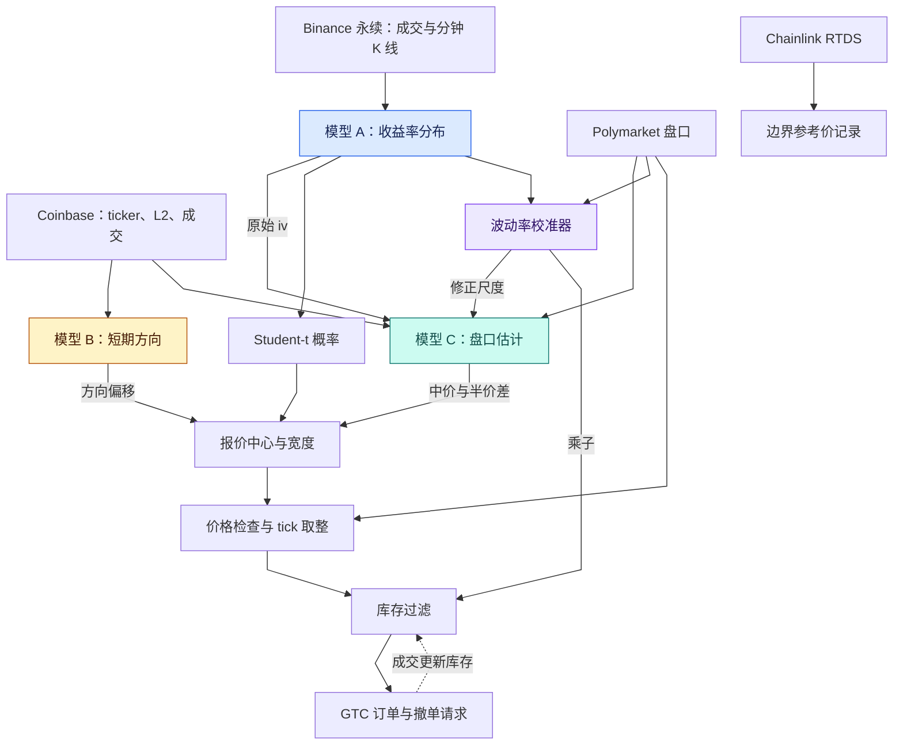

# poly-15min

[English version](README.md) · **简体中文**

 [](LICENSE)

一个面向 Polymarket 15 分钟加密资产**涨跌**二元合约的量化做市引擎，由三个独立训练的 Transformer 模型驱动。现公开源码，供对二元期权做市和序列模型应用感兴趣的读者参考。

> [!IMPORTANT]
> **已归档，不再维护。** **本仓库中的全部代码和文档均由 AI 生成。** 代码通过**聊天界面使用 GPT-5 生成**；文档使用 **Opus 和 GPT-6** 生成。
>
> **代码与文档的正确性均未经人工审阅。** 作者从未审阅过用于实盘交易的代码。文档可能与实现存在冲突；了解系统的实际行为时，请以源码为准。
>
> 该策略曾在 BTC 上盈利，并于 **2025 年 12 月下旬**停止盈利。**其利润与头部账户相比，仅占极小的一部分。**
>
> 实盘系统曾持续修改。本仓库保留了大体相同的实现，但代码和模型参数可能与实际交易时使用的版本有所不同，不一定对应某个具体的实盘版本。

> [!WARNING]
> **请勿将本系统连接到有资金的账户。** 系统会记录**明文 API 认证信息**，部分风控检查会直接终止进程，**却不撤销仍在盘口上的订单**。
>
> **使用本仓库的风险由使用者自行承担。** 本仓库仅供研究与算法交流，不提供任何保证或投资建议。**在适用法律允许的范围内，作者不对使用本仓库造成的交易损失或其他损害承担责任。** 具体条款以 [LICENSE](LICENSE) 为准。

**[三个模型](#三个模型) · [架构](#工作原理) · [技术手册](docs/technical-reference.zh-CN.md) · [许可证](#许可证)**

## 目录

| 策略与模型 | 实现与参考 |
|---|---|
| [这是什么](#这是什么) | [仓库结构](#仓库结构) |
| [概览](#概览) | [环境与配置](#环境与配置) |
| [工作原理](#工作原理) | [训练数据与 checkpoint](#训练数据与-checkpoint) |
| [三个模型](#三个模型) | [技术文档](#技术文档) |
| [波动率校准](#波动率校准) | [何时及为何停止盈利](#何时及为何停止盈利) |
| [一个报价是如何形成的](#一个报价是如何形成的) | [许可证](#许可证) |
| [15 分钟生命周期](#15-分钟生命周期) |  |

---

## 这是什么

系统面向滚动发行的 15 分钟合约：判断窗口结束时，某个加密资产的价格是否高于或等于窗口开始时的参考价。获胜 token 每份兑付 1 美元，失败 token 兑付 0 美元，具体以该市场的结算规则为准。`btc-updown-15m-1765306800` 这类 slug 用于标识资产和窗口起点。

策略围绕估计的合约价值生成买卖报价，以赚取价差为目标，同时管理成交后累积的库存。它也会用短期方向信号调整报价，并在特定条件下只保留单边交易。YES 与 NO 的兑付互补。盘口报价和实际成交价取决于各自订单簿中的订单，YES 与 NO 的价格之和可能高于或低于 1 美元。

这个过程需要三种不同的估计：

1. **标的收益率分布。** 到期前价格可能波动多大，对应的 Up 概率是多少？
2. **短期方向。** 接下来几秒标的是否可能发生方向性变动，报价是否应该随之调整？
3. **Polymarket 盘口。** 报价应该以什么中价和半价差为起点？

引擎组合这些估计，应用价格和库存控制，并在 900 秒的合约窗口内管理订单。模型概率是策略的定价输入；可成交价格取决于可用流动性。

---

## 概览

| 属性 | 内容 |
|---|---|
| 交易场所 | Polymarket CLOB；客户端配置为使用 Polygon |
| 合约 | 15 分钟加密资产涨跌二元合约 |
| 策略 | 做市，结合方向性报价调整和库存过滤 |
| 建模资产 | BTC、ETH、SOL、XRP |
| 实际交易资产 | **仅 BTC**，通过 `allowed_bases={"BTC"}` 限定 |
| 合约时长 | 900 秒；名义报价区间为 877 秒 |
| 模型 | 3 种架构、6 个 checkpoint，合计 5,772,944 个可训练参数 |
| 行情数据 | Binance 永续、Coinbase、Polymarket CLOB、经 RTDS 接收的 Chainlink 数据 |
| 技术栈 | Python 3.10+、PyTorch、asyncio |
| 源码 | 11 个 Python 模块、14,234 行 |

四种资产都具有行情采集和预测路径。交易引擎只接受 BTC 的交易快照，其他资产仍会被建模和记录。

---

## 工作原理



三个模型各有分工。A 提供收益率分布，B 调整方向，C 提供主要的报价中心和宽度。A 的原始尺度与经市场价格修正的尺度也会进入 C。独立的校准乘子用于调整库存限制。交易引擎计算 Student-t 概率时使用 A 的原始尺度。

Coinbase 提供当前标的价格的近似值，以及在本地采样得到的窗口开始参考价。Chainlink 观测在窗口边界附近被记录下来。合约判定与结算由交易场所负责。

---

## 三个模型

三个模型都使用 Transformer 编码器提取近期行情中的信息。各模型的输入、输出形式和资产专用参数各不相同。

| 模型 | 序列 | 其他输入 | 编码器宽度 | 输出 | 可训练参数 |
|---|---|---|---|---|---|
| A | 300 × 14 | 19 个静态特征 | 96 | Student-t `iv`、`df` | 420,995 × 4 个资产 |
| B | 32 × 75 | 229 个静态特征、资产 ID | 256 | 3 个期限 × 5 个分位数估计 | 2,596,156 |
| C | 最多 64 × 22 | 有效位置 mask、资产 ID | 192 | 中价残差、半价差 | 1,492,808 |

### 模型 A：价格可能波动多大？

**目的。** 估计合约剩余期限内的对数收益率分布。

**输入。** 由 Binance 永续成交构建的 300 行序列，每行包含 14 个特征：收盘价、VWAP、成交量、买卖方向拆分、成交笔数、近期收益率和成交量失衡。另有 19 个静态特征，描述分钟级收益率、波动率、永续与指数基差、日内时间及剩余期限。历史序列使用完整的一秒网格；实时缓冲不补齐空秒，因此 300 行实时数据不一定恰好覆盖五分钟。

**架构。** 编码器宽度为 96，共四层，每层包含四个 attention head，通过 attention pooling 汇总序列。静态向量由独立 MLP 处理后再融合。每个资产使用独立网络，各有 **420,995 个可训练参数**。

**输出。** `iv` 与 `df`，分别是位置参数为零的 Student-t 分布的尺度和自由度。尺度对应 900 秒收益率期限；剩余期限为 `tau` 秒时，将其乘以 `sqrt(tau / 900)`。`df` 控制尾部厚度，也决定尺度换算为标准差时的系数；该换算要求标准差存在。训练样本的剩余期限覆盖 5 到 900 秒。

**策略用途。** 根据收益率分布和窗口开始参考价的近似值计算 Up 概率，再用这个概率对报价中心做幅度受限的修正。A 也向 C 和波动率校准器提供原始尺度。

[模型 A 的特征、架构、损失与训练](docs/technical-reference.zh-CN.md#model-a)

### 模型 B：接下来几秒可能往哪走？

**目的。** 估计未来 2 秒、5 秒和 10 秒收益率的分位数。

**输入。** 最近 32 个连续的 Coinbase 行情 tick，每个含 75 个特征，覆盖 L2 深度、失衡、各档挂单量、成交流、收益率、波动率、价差和时间戳。229 维静态向量由资产 ID、最新特征行、窗口均值与标准差、日内时间及周末标记组成。相邻间隔超过一秒时，窗口会被重置。

**架构。** 编码器宽度为 256，共四层，每层包含八个 attention head，使用 last token 作为 readout。该表示与静态向量融合后，进入四个资产专属 output head 之一。共享 backbone 与全部 output head 合计 **2,596,156 个可训练参数**。

**输出。** 每个期限输出 0.10、0.25、0.50、0.75、0.90 五个分位数估计，共 15 个值。中位数表示方向，四分位距提供不确定性的近似指标。

**策略用途。** 策略综合方向、由分位数推算的概率，以及中位数相对不确定性指标的大小形成分数，使报价中心最多偏移**每份 2 美分**。交易引擎还使用该分数决定单边交易方向，以及是否放宽 crossing 限制。

[模型 B 的输入、分位数损失与方向策略](docs/technical-reference.zh-CN.md#model-b)

### 模型 C：报价应采用什么中价和价差？

**目的。** 根据混合的 Coinbase 与 Polymarket 事件，估计盘口中价残差和半价差。

**输入。** 最多 64 个事件、每个 22 个特征，描述 moneyness（价内外程度）、Coinbase 波动率与成交流、Polymarket 价格和挂单量、模型尺度与市场修正尺度、剩余期限、事件类型，以及各事件相对最新事件的时间差。至少需要 16 个连续事件；不足 64 个事件时，在序列左侧 padding，并附带有效位置 mask。迟到事件按时间戳插入，其后的状态重新按序回放。

**架构。** 编码器宽度为 192，共四层，每层包含八个 attention head。编码完成后，将 asset embedding 加到 last token 表示上，再送入资产专属 output head。模型共有 **1,492,808 个可训练参数**。

**输出。** 一个中价残差和一个非负半价差。引擎把残差加到参考中价上，重建预测中价，再由半价差推导预测买卖价。参考价格检查找不到可用值时，解码器以零作为参考中价。

**策略用途。** C 决定主要的报价中心和宽度。引擎将 C 的输出与 A 的概率修正、B 的方向偏移组合后构造订单。

[模型 C 的事件处理、输入与解码](docs/technical-reference.zh-CN.md#model-c)

---

## 波动率校准

模型 A 描述标的收益率分布，而 Polymarket 价格反映市场对二元结果的定价。校准器以按挂单量加权的 Polymarket 价格为目标，反解相应的 Student-t 尺度，再与 A 的输出比较，将两者联系起来。

卡尔曼式滤波器在对数空间平滑两者的比值，使乘子保持为正。价差较宽或价格接近 0.5 时，观测权重较低。标的价格恰好等于窗口开始参考价时，对称模型给出的概率恒为 0.5，与尺度无关，因此不能用这个概率确定波动率。

滤波器产生两个相关的数值：`pm_iv_mult` 是用于调整库存限制的乘子，`pm_iv_implied_900` 是供模型 C 使用的修正尺度。交易引擎直接计算 Student-t 概率时，仍使用**模型 A 的原始尺度**。

[校准输入与更新方程](docs/technical-reference.zh-CN.md#calibration)

---

## 一个报价是如何形成的

对于满足输入条件的行情快照，报价构造分为四步：

1. **C 给出初始中心。** 以重建的中价作为报价起点。
2. **B 加入方向。** 方向偏移最多将中心移动 0.02。
3. **A 将中心拉向分布定价。** 朝 A 的 Up 概率移动剩余差值的 15%，单次修正幅度不超过 0.01。
4. **C 给出基础宽度。** 在其半价差上加入由近期 Coinbase 收益率波动计算的附加项，最终至少为一个 tick。

引擎结合实际盘口和预测盘口检查报价，拒绝 0.01–0.99 区间之外的边缘价格，按 tick size 将买价向下、卖价向上取整。NO 报价由 YES 的互补价格推导。库存和方向过滤决定最终保留哪些交易动作；根据已有持仓，引擎可以选择买入另一侧 token，或卖出已持有的份额。

当 `abs(seq_score) <= 0.5` 时，crossing 检查要求报价与对侧预测报价至少相隔一美分；方向信号更强时会放宽这一限制。订单使用 **GTC**，没有交易所强制执行的 post-only 标记，因此可立即成交的订单可能以 taker 身份成交。引擎另行管理撤单候选。

[报价构造](docs/technical-reference.zh-CN.md#quoting) · [订单执行与库存控制](docs/technical-reference.zh-CN.md#execution)

---

## 15 分钟生命周期

令 `S` 为窗口起点，`B = S + 900` 为到期时刻。

| 时间 | 行为 |
|---|---|
| 约 `S - 10` | 停止读取上一份合约的盘口 |
| 约 `S - 5` | 订阅起点为 `S` 的新合约 |
| `S + 1` | 清空模型 C 状态，保留模型 B 的标的行情历史 |
| `S` 至 `S + 8` | 开始阶段不允许新下单 |
| `S + 8` 至 `S + 885` | 数据、模型与风控条件满足后允许报价 |
| `S + 885` 起 | 收尾检查尝试撤销账户全部挂单 |
| `B` | 合约到期；在边界附近记录参考价格观测 |

名义报价区间为 **877 秒**。每个合约的 worker 只保留最新待处理快照，并丢弃中间更新。连续 0.5 秒没有收到可接受的本地快照时，inactivity 检查会尝试撤单。独立持仓线程每五秒轮询一次，在持仓超过对应上限四倍或请求连续失败时强制退出。发出撤单请求或终止进程后，交易所上仍可能有活跃订单。

[运行调度](docs/technical-reference.zh-CN.md#runtime) · [时间控制](docs/technical-reference.zh-CN.md#timing)

---

## 仓库结构

```text
poly-15min/
├── live_prediction.py   实盘入口、调度、快照组装与交易交接
├── live_lib.py          模型 A 加载、Binance 特征、HTTP 与日志
├── market_lib.py        共享状态、行情、市场发现、定价与校准
├── utils.py             模型 A 架构、历史特征与训练
├── train_seq.py         模型 B 训练
├── quote_seq.py         模型 B 推理与方向性报价策略
├── train_iv.py          模型 C 训练
├── quote_iv.py          模型 C 事件回放与推理
├── trade.py             报价构造、订单调度与库存过滤
├── trade_lib.py         CLOB 认证、订单 I/O 与持仓追踪
├── hub_debug.py         定期记录共享状态快照
├── runs/               模型 A checkpoint，BTC、ETH、SOL、XRP 各一份
├── runs_seq_t/          模型 B checkpoint 与训练参数
├── runs_iv_delta/       模型 C checkpoint、参数与解码元数据
├── data_seq32/          模型 B 特征定义与归一化统计量
├── data_iv64/           模型 C 归一化统计量
└── docs/               中英文技术手册
```

实时系统通过 asyncio 处理行情和模型调度，另用独立线程执行阻塞式订单 I/O 与账户监控。共享 hub 状态连接行情处理器、预测引擎、校准器和交易引擎。

---

## 环境与配置

### 依赖与程序入口

源码要求 Python 3.10 或更高版本。主要依赖包括 PyTorch、NumPy、pandas、SciPy、scikit-learn、matplotlib、aiohttp、websockets、websocket-client、requests 和 py-clob-client。仓库未固定依赖版本。

`live_prediction.py` 是实盘入口，会初始化模型、订阅行情、创建已认证的交易会话并启动订单引擎。实时模型 A 在 CUDA 可用时使用 CUDA，否则使用 CPU；B 和 C 使用 CPU。`train_seq.py`、`train_iv.py` 是 B/C 的训练入口，A 的可复用训练代码位于 `utils.py`。

### 配置

会话初始化时，从环境变量和进程工作目录下的 `key.env` 文件加载认证设置，已有环境变量优先。会话根据签名配置派生 API 认证信息；真实密钥和账户取值应保存在公开仓库之外。

模型开关、模型路径和 `MM_BTC_*` 配置在模块导入时读取，早于会话加载 `key.env`。覆盖这些默认值需要事先将变量放入进程环境；随后从 `key.env` 读入的同名项不会改变已经初始化的配置值。各阶段详见手册的[配置参考](docs/technical-reference.zh-CN.md#configuration)。

| 变量 | 用途 |
|---|---|
| `PRIVATE_KEY` / `PM_PRIVATE_KEY` / `PK` | 钱包签名私钥，按顺序使用首个可用值 |
| `PM_FUNDER` / `FUNDER` | 可选的交易资金所在账户地址（funder） |
| `PM_ADDRESS` | 持仓检查的备用地址 |
| `PM_OWNER_ID` | 可手动指定用于识别本账户成交记录的 owner ID |
| `SEQ_RUN_DIR`、`SEQ_DATA_DIR` | 模型 B checkpoint 与元数据位置 |
| `IV_RUN_DIR`、`IV_DATA_DIR` | 模型 C checkpoint 与元数据位置 |
| `MM_BTC_QSIZE`、`MM_BTC_INVCAP`、`MM_BTC_VOLCAP` | 报价数量、库存上限、累计成交份额上限 |

BTC 默认每笔报价 5 份，库存上限 20 份，每个 slug 的累计成交份额上限为 20,000。这三个以 BTC 命名的变量实际上被所有资产的配置读取。`ENABLE_SEQ` 和 `ENABLE_IV` 控制模型初始化。交易引擎需要 C 的中价和半价差输出，关闭 C 后，报价流程将缺少所需输入。

### 日志与账户数据

主日志为 `data/logs/live_predictor.log`，每条记录由时间戳/级别前缀和 JSON 组成。共享状态快照写入 `data/debug/`，市场发现结果写入 `temp/`，Chainlink 边界记录写入 `data/polymarket/resolution/`。

用户 WebSocket 订阅消息会把 API key、secret 和 passphrase 写入 `logs/ws_user/sent/`；持仓监控会把钱包地址和持仓写入 `logs/inv_watch/`。压缩包内容需要单独检查，发布时应排除生成的账户数据和认证文件。checkpoint 只应从可信来源加载。

[完整配置、日志与排错参考](docs/technical-reference.zh-CN.md#operations)

---

## 训练数据与 checkpoint

全部训练数据、模型 A 的训练入口脚本，以及模型 B/C 的数据集构建器已永久丢失。训练函数和 B/C 训练程序仍然保留。重新生成六个历史模型需要已经丢失的数据与构建流程。

仓库包含四个独立的 A checkpoint，以及 B、C 各一个共享多资产 checkpoint。保存的元数据包括模型维度、归一化统计量和训练参数；A checkpoint 还包含数据日期和 epoch 指标。

[训练流程与模型文件](docs/technical-reference.zh-CN.md#training)

---

## 技术文档

- [完整技术手册](docs/technical-reference.zh-CN.md)

手册涵盖合约与参考价格、行情处理、全部模型输入和网络层、损失与训练、校准和报价公式、订单执行、配置及实现问题。

---

## 何时及为何停止盈利

该策略于 2025 年 12 月下旬停止盈利。高频交易中，延迟至关重要。本系统依赖交易所二手行情，相比直接获取交易所数据的参与者，至少多出 100 毫秒延迟。这一差距抹去了原有的交易优势。

---

## 许可证

本项目采用 [Sustainable Use License 1.0](LICENSE)，以 **源码可用（source-available）** 的方式发布。Copyright (c) 2026 QuantumSlayer。

| 权限 | 条件 |
|---|---|
| 使用与修改 | 允许用于自身内部业务，或用于非商业用途、个人用途 |
| 分享原版或修改后的软件 | 仅允许以非商业目的免费提供给他人 |
| 声明保留 | 保留许可证、版权及其他许可方声明，向接收者提供许可条款，并显著注明所作修改 |

许可证适用于 QuantumSlayer 有权许可的项目代码、文档及所提供的模型文件。第三方材料保留各自的许可条款。许可条件以完整的英文[许可证正文](LICENSE)为准，本表仅作中文摘要。
